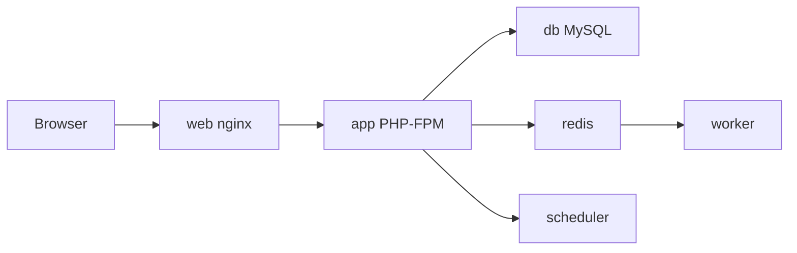

# Chapter 16 — Capstone: PHP stack in Compose

**Course chapter:** [Capstone: PHP stack in Compose](https://docker.learnio.dev/learn/sections/chapter-compose-capstone-php-slice/)

**Scope lesson:** [Capstone scope: nginx, PHP-FPM, MySQL, Redis](https://docker.learnio.dev/learn/sections/chapter-compose-capstone-php-slice/compose-capstone-php-slice-capstone-scope-nginx-php-fpm-mysql-redis)

Academy reference for the chapter 16 capstone — six services wired with Compose, healthchecks, and a shared smoke command.

**Exercise / solution (course reference tree):** [exercise-stand-up-the-capstone-stack](exercise-stand-up-the-capstone-stack/) — matches lesson 16.9/16.10 (`compose.dev.yaml`, `app/public/`, multi-stage Dockerfile, `make smoke` on port 8080).

The parent folder below is an alternate chapter layout (`src/`, `compose.override.yaml`, port 8082) kept for earlier lessons in the chapter.

## Capstone scope

| Service | Role |
| ------- | ---- |
| `web` | nginx — HTTP edge, publishes port 8082 on loopback |
| `app` | PHP-FPM — application runtime (FastCGI only, no host port) |
| `db` | MySQL — durable state + init schema/seed |
| `redis` | Cache keys and queue backend |
| `worker` | Long-running queue consumer (`bin/worker.php`; Laravel: `php artisan queue:work`) |
| `scheduler` | Periodic enqueue loop (`bin/scheduler.php`; Laravel: `php artisan schedule:work`) |



## Project layout

```text
.
├── compose.yaml              # base stack
├── compose.override.yaml     # dev bind mounts (auto-merged)
├── compose.prod.yaml         # production-shaped overlay (explicit -f)
├── .env.example
├── Makefile                  # make smoke
├── docker/
│   ├── php/Dockerfile
│   ├── nginx/default.conf
│   └── mysql/initdb/
└── src/
    ├── public/               # index + healthz
    └── bin/                  # worker + scheduler
```

## Quick start

```bash
cp .env.example .env
make config
make smoke
```

Or step by step:

```bash
docker compose up -d --build --wait
curl -fsS http://127.0.0.1:8082/healthz.php
curl -fsS http://127.0.0.1:8082/
docker compose ps
docker compose logs --tail 20 worker
docker compose down
```

## What each file teaches

| Piece | Lesson |
| ----- | ------ |
| `compose.yaml` | Service roles, depends_on + healthchecks, named volume for MySQL |
| `compose.override.yaml` | Local dev layering without forking the base file |
| `compose.prod.yaml` | Explicit prod overlay with `docker compose -f … -f …` |
| `docker/php/Dockerfile` | Production `php.ini`, `pdo_mysql` + `redis`, non-root, FPM health |
| `docker/nginx/default.conf` | Static files + FastCGI to `app:9000` |
| `docker/mysql/initdb/` | First-boot schema and seed via `/docker-entrypoint-initdb.d` |
| `Makefile` | One `smoke` command the whole team can rerun |

## Inspect tags and digests (after pull/build)

```bash
docker image ls
docker image inspect --format '{{.RepoTags}} {{.RepoDigests}}' capstone-app
```

## Production overlay

```bash
docker compose -f compose.yaml -f compose.prod.yaml up -d --build
```

## Lesson acceptance

- `docker compose config` parses cleanly
- `make smoke` exits 0
- `curl` against `/healthz.php` returns `{"status":"ok"}`
- You can name which service owns HTTP, PHP, MySQL, Redis, queues, and schedules

## What you proved

- Dockerfile builds the app image; Compose wires the system
- env files supply configuration; healthchecks show readiness
- A teammate can clone, run `make smoke`, and explain the six roles

← [Docker fundamentals](../README.md)
