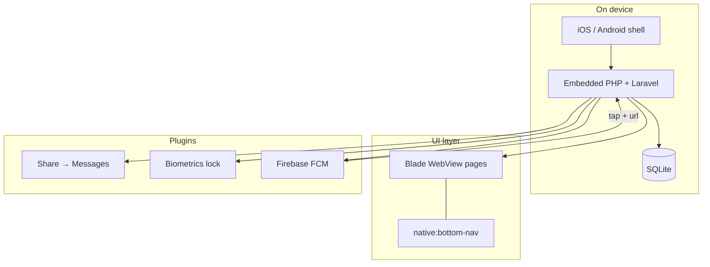

# Chapter 10 — Field Notes: capstone demo walkthrough

**Capstone:** **Chapter 10** · [← Chapter 9](../9-deployment-and-store-submission/chapter-project-release-candidate/) · [All chapters](../CAPSTONE.md)

**Course:** [10.1 Capstone demo: the complete Field Notes app](https://php-apps.learnio.dev/learn/sections/chapter-course-closeout/capstone-demo-field-notes-walkthrough)

**Previous:** [Chapter 9 — Release candidate](../9-deployment-and-store-submission/chapter-project-release-candidate/) · **Next:** [Final polish](https://php-apps.learnio.dev/learn/sections/chapter-course-closeout/final-polish-performance-permissions-store-copy)

**Built on:** [Chapter 9 — Release candidate](../9-deployment-and-store-submission/chapter-project-release-candidate/) · **You add:** nothing — prove the full app on device.

Docs: [NativePHP Mobile](https://nativephp.com/docs/mobile/3) · [Deployment](https://nativephp.com/docs/mobile/3/getting-started/deployment)

---

## Prove the whole app on device — not in the browser

This is the final walkthrough of **Field Notes** — one Laravel + NativePHP repo you extended from Chapter 1 through Chapter 9. You are not adding features. You demonstrate that the course outcomes work on a release candidate build.

**Runnable app:** use the [Chapter 9 release candidate](../9-deployment-and-store-submission/chapter-project-release-candidate/) snapshot (or your own copy if you followed every chapter project).

---

## Chapter solutions

| Ch | Solution | Course lesson |
| -- | -------- | ------------- |
| 1 | [First mobile screen](../1-introduction-and-mobile-architecture/chapter-project-first-mobile-screen/) | [your first screen on mobile](https://php-apps.learnio.dev/learn/sections/chapter-introduction-and-mobile-architecture/chapter-project-your-first-screen-on-mobile) |
| 2 | [Environment sign-off](../2-environment-setup/chapter-project-environment-sign-off/) | [environment sign-off and first simulator run](https://php-apps.learnio.dev/learn/sections/chapter-environment-setup/chapter-project-environment-sign-off-and-first-simulator-run) |
| 3 | [Icon, splash, note list UI](../3-webview-ui-branding-and-assets/chapter-project-icon-splash-note-list/) | [icon, splash, and note list UI](https://php-apps.learnio.dev/learn/sections/chapter-webview-ui-branding-and-assets/chapter-project-icon-splash-and-note-list-ui) |
| 4 | [EDGE shell](../4-edge-native-navigation/chapter-project-edge-shell/) | [EDGE shell for Field Notes](https://php-apps.learnio.dev/learn/sections/chapter-edge-native-navigation/chapter-project-edge-shell-for-field-notes) |
| 5 | [Send note as text](../5-native-functions-plugins-and-core-apis/chapter-project-send-note-as-text/) | [photo attachment in Field Notes](https://php-apps.learnio.dev/learn/sections/chapter-native-functions-plugins-and-core-apis/chapter-project-photo-attachment-in-field-notes) |
| 6 | [Offline notes CRUD](../6-on-device-databases-and-offline-data/chapter-project-offline-notes-crud/) | [offline notes CRUD](https://php-apps.learnio.dev/learn/sections/chapter-on-device-databases-and-offline-data/chapter-project-offline-notes-crud) |
| 7 | [Biometric lock](../7-security-and-authentication/chapter-project-lock-field-notes/) | [lock Field Notes](https://php-apps.learnio.dev/learn/sections/chapter-security-and-authentication/chapter-project-lock-field-notes) |
| 8 | [Deep link + sync stub](../8-deep-links-push-and-background-sync/chapter-project-deep-link-sync-stub/) | [deep link and sync stub](https://php-apps.learnio.dev/learn/sections/chapter-deep-links-push-and-background-sync/chapter-project-deep-link-and-sync-stub) |
| 9 | [Release candidate](../9-deployment-and-store-submission/chapter-project-release-candidate/) | [Field Notes release candidate](https://php-apps.learnio.dev/learn/sections/chapter-deployment-and-store-submission/chapter-project-field-notes-release-candidate) |
| **10** | **This walkthrough** | [capstone demo](https://php-apps.learnio.dev/learn/sections/chapter-course-closeout/capstone-demo-field-notes-walkthrough) |

### Stack at a glance

| Ch | You ship |
| -- | -------- |
| 1 | Jump + basic mobile home |
| 2 | Toolchain sign-off + first `native:run` |
| 3 | Icon, splash, branded UI |
| 4 | EDGE top bar + bottom nav |
| 5 | Share plugin on Compose |
| 6 | SQLite CRUD on Home |
| 7 | Optional biometric app lock |
| 8 | Deep links, push enroll, sync job stub |
| 9 | Versioned release builds + store checklist |
| 10 | End-to-end demo on device |

---

## What Field Notes is

Field Notes is a notes app that runs Laravel on the device inside a native shell:

- Blade views in a WebView for UI
- EDGE components (`native:bottom-nav`) for native chrome
- SQLite for offline CRUD
- Plugins for Share, Biometrics, SecureStorage, Firebase push
- Deep links and FCM for notification → note navigation
- Signed iOS and Android builds from Chapter 9

If you followed each chapter project, you already have this. This lesson is the script to prove it.

---

## Course outcomes checklist

Record or present on a **physical device** (TestFlight, Play internal track, or `native:run` release build). Browser-only does not count for the final demo.

| # | Outcome | What to show | Built in |
| --- | --- | --- | --- |
| 1 | Mobile app | Cold start — icon, splash, home loads | Ch 1–3 |
| 2 | EDGE navigation | Bottom tabs persist: Home · Compose · Settings | Ch 4 |
| 3 | Send text (Share) | Compose note → Share sheet → Messages/SMS with body | Ch 5 |
| 4 | CRUD offline | Create, edit, delete note in airplane mode | Ch 6 |
| 5 | App lock | Biometric prompt before notes; cancel stays locked | Ch 7 |
| 6 | Push + deep link | Notification with preview → tap → opens that note | Ch 8 |
| 7 | Store builds | TestFlight and Play internal track screenshots or live | Ch 9 |

**Send text** in this course means two paths — both count:

1. **Share plugin** — user picks Messages from the system sheet (Chapter 5).
2. **Push notification** — alert on lock screen, tap navigates via deep link (Chapter 8).

You do not need a custom SMS gateway in the app.

---

## Suggested demo script (8–10 minutes)

Run on the same release candidate you built in Chapter 9. Narrate the stack as you go.

### 1. Cold start (30 sec)

Launch from home screen. Call out branded icon and splash from Chapter 3. Home shows your note list (SQLite data from Chapter 6).

### 2. EDGE tabs (45 sec)

Tap Home → Compose → Settings. The native bottom bar stays fixed while Blade content swaps — that is EDGE, not a JavaScript SPA tab bar. Safe-area padding (`nativephp-safe-area`) should clear the notch and home indicator.

### 3. Create a note (1 min)

Add a note with a distinctive title and body. Confirm it appears on Home. This is Eloquent against on-device SQLite — no network required.

### 4. Send as text (1 min)

Open Compose (or share from the note edit screen). Submit → `Share::file()` opens the system share sheet. Pick Messages. Recipient field opens with your note body. You never left the app to write native Swift or Kotlin for this.

### 5. Biometric lock (45 sec)

If lock is enabled in Settings, background the app and return — or restart. `Biometrics::prompt()` from PHP; result via `#[OnNative(Completed::class)]`. Failed or cancelled auth must not show note content.

### 6. Push and deep link (1 min)

From the Chapter 8/9 project directory:

```bash
php artisan field-notes:push-payload {note-id}
```

Use your enrolled device token and Firebase config from Chapter 8. Notification shows preview text. Tap opens the app at `/notes/{id}` — custom scheme (`NATIVEPHP_DEEPLINK_SCHEME`) or associated domain if you configured one.

When `nativephp/mobile-firebase` is wired for server-side sends, follow lesson 8.4 for `fcm:send` with the same deep-link URL.

### 7. Offline edit (1 min)

Enable airplane mode. Edit the note. Confirm changes persist after force-quit and relaunch. The queue worker (Chapters 6/8) may sync when online — optional for the demo.

### 8. Store builds (1 min)

Show TestFlight install on iOS and internal testing track on Play Console for Android. Mention version and version code from `.env` — each upload needs a bump.

### 9. Stack recap (1 min)

One sentence each: Laravel routes and controllers, NativePHP shell, EDGE in Blade, SQLite on device, plugins registered with `native:plugin:register`, Firebase for push, `native:release` for store artifacts.

---

## Architecture at a glance



---

## Pre-demo checklist

Before you record or present:

- [ ] Release build installed (not Jump-only unless that is all you have)
- [ ] At least one note in SQLite for CRUD and share demos
- [ ] Firebase token enrolled on the demo device (Chapter 8)
- [ ] Push test command or server route ready
- [ ] Biometrics enabled on a device that supports Face ID / fingerprint
- [ ] TestFlight or Play internal link ready to show
- [ ] `cleanup_env_keys` reviewed — no secrets in the bundle you demo
- [ ] `./scripts/verify-release-candidate.sh` passes (Chapter 9)

---

## If something is missing

| Symptom | Go back to |
| --- | --- |
| Blank home / no notes | [Chapter 6](../6-on-device-databases-and-offline-data/chapter-project-offline-notes-crud/) — migrations, Eloquent, list view |
| Share sheet does not open | [Chapter 5](../5-native-functions-plugins-and-core-apis/chapter-project-send-note-as-text/) — `nativephp/mobile-share`, `Share::file()` |
| Tabs disappear or feel like web-only | [Chapter 4](../4-edge-native-navigation/chapter-project-edge-shell/) — `native:bottom-nav` in layout, rebuild |
| Lock never prompts | [Chapter 7](../7-security-and-authentication/chapter-project-lock-field-notes/) — `Biometrics::prompt()` + `Completed` event |
| Push never arrives | [Chapter 8](../8-deep-links-push-and-background-sync/chapter-project-deep-link-sync-stub/) — config files in project root, `native:run` rebuild, real device |
| Tap notification opens browser | [Chapter 8](../8-deep-links-push-and-background-sync/chapter-project-deep-link-sync-stub/) — deep link scheme and payload URL |
| Cannot install from store | [Chapter 9](../9-deployment-and-store-submission/chapter-project-release-candidate/) — signing, version bump, provisioning |

---

## Get the release candidate

```bash
git clone https://github.com/stuarttodd-dev/halfshellstudios-academy.git
cd halfshellstudios-academy/using-native-php/9-deployment-and-store-submission/chapter-project-release-candidate
chmod +x setup.sh scripts/verify-release-candidate.sh
./setup.sh
bash scripts/verify-release-candidate.sh
php artisan native:run ios   # or android
```

---

## Remember

The course goal was always one shippable mobile app written in PHP. Field Notes is that proof: Laravel on the device, native UX where it matters, offline data, plugins instead of platform boilerplate, and builds on both stores.

- [10.2 Final polish](https://php-apps.learnio.dev/learn/sections/chapter-course-closeout/final-polish-performance-permissions-store-copy)
- [10.3 Your next 30 days](https://php-apps.learnio.dev/learn/sections/chapter-course-closeout/your-next-30-days-ship-and-iterate)

← [Field Notes capstone index](../CAPSTONE.md)
